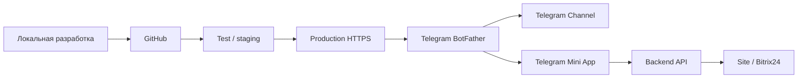

# Telegram Mini App: VPS / GitHub / Production Spec

Дата: 2026-03-25

## 1. Цель

Сделать Telegram Mini App для проекта `Счетчики Юг` не локальным стендом, а полноценным онлайн-приложением:

- локальная разработка и отладка на компьютере;
- хранение кода в GitHub;
- тестирование на staging/test-адресе;
- публикация на боевом HTTPS-адресе на сервере;
- подключение этого адреса к Telegram BotFather;
- безопасная работа без зависимости от `127.0.0.1`.

## 2. Что должно работать в бою

- открытие Mini App из Telegram-канала и/или бота;
- каталог, акции, хиты, сервисные разделы;
- регистрация карты клиента;
- передача заявки на сайт и в Bitrix24;
- получение статуса карты в Mini App;
- показ оптовых цен после активации и синхронизации;
- работа на телефоне и на Telegram Desktop;
- одинаковая читаемость на светлой и темной Telegram-теме.

## 3. Идеальная схема

### Роли слоев

- Локальная разработка: правим код, тестируем UI и логику.
- GitHub: хранилище кода, история изменений, backup.
- Test / staging: безопасная проверка перед боем.
- Production HTTPS: боевой URL Mini App и backend.
- Telegram BotFather: хранит публичный Web App URL.
- Telegram Channel: витрина и вход в Mini App.
- Backend API: регистрация карты, статусы, запросы, синхронизация.
- Site / Bitrix24: карточки клиента, заявки, оптовые статусы, CRM.

## 4. Что где должно жить

### 4.1 Локально

Локально на компьютере:

- `index.html`
- `sync_backend`
- `catalog_real.js`
- `catalog_priced.json`
- вспомогательные скрипты и документация

Локальный запуск нужен только для разработки и отладки.

### 4.2 GitHub

В GitHub должны лежать:

- исходники Mini App;
- backend-код;
- документация;
- скрипты запуска;
- чек-листы;
- конфиги без секретов.

GitHub не должен быть единственным боевым runtime. Это хранилище и контроль версий.

### 4.3 Test / staging

Нужен отдельный тестовый адрес или тестовая папка на сервере, чтобы:

- проверять новый код до выкладки;
- не ломать боевой сайт;
- тестировать регистрацию карты;
- проверять кнопки и переходы;
- проверять тему Telegram.

### 4.4 Production

Боевой Mini App должен открываться по публичному HTTPS-адресу:

- на домене проекта;
- или на поддомене вида `app.домен.ru`;
- или в отдельной папке сайта, если это безопасно.

Боевой backend должен быть доступен по публичному HTTPS-адресу.

## 5. Что нельзя делать в production

- нельзя оставлять Mini App на `127.0.0.1`;
- нельзя держать боевой backend только на локальном компьютере;
- нельзя использовать GitHub Pages как финальный runtime для бизнес-функций;
- нельзя менять корень боевого сайта без отдельного плана;
- нельзя ломать текущий сайт `Счетчики Юг`.

## 6. Рекомендуемая архитектура для проекта

### Вариант A. Лучший

- сайт остается на текущем сервере;
- Mini App frontend выкладывается в отдельную папку или поддомен;
- backend API для Mini App живет на VPS;
- Telegram BotFather смотрит на публичный HTTPS Web App URL.

### Вариант B. Если сервер позволяет держать Python постоянно

- сайт и Mini App frontend живут на одном сервере;
- backend API тоже живет там же;
- все работает в одном домене;
- используется отдельный процесс/сервис для backend.

### Вариант C. Если есть только FTP без нормального runtime

- сайт не трогаем;
- Mini App frontend можно положить рядом с сайтом;
- backend выносим на VPS;
- Telegram ведет в публичный URL Mini App.

## 7. Порядок внедрения

### Этап 1. Локальная разработка

- правим код в локальной папке;
- проверяем UI;
- проверяем бизнес-логику;
- фиксируем баги;
- сохраняем изменения в Git.

### Этап 2. GitHub

- коммитим изменения;
- пушим в репозиторий;
- используем GitHub как точку восстановления;
- при необходимости создаем test-ветку.

### Этап 3. Test / staging

- выкладываем проверочную версию;
- тестируем Telegram Mini App;
- тестируем registration flow;
- тестируем CORS, backend, CRM;
- тестируем светлую и темную тему.

### Этап 4. Production

- переносим финальную версию на боевой сервер;
- обновляем Web App URL в BotFather;
- проверяем путь `канал -> Mini App -> backend -> Site -> Bitrix24`;
- фиксируем, что карта и статусы работают.

## 8. Схема данных

### Карта клиента

Нужно хранить и передавать:

- имя;
- фамилию;
- телефон;
- email;
- город;
- тип клиента;
- Telegram user id;
- Telegram username;
- статус карты;
- номер карты;
- источник регистрации.

### Статусы

- `Гость`
- `На проверке`
- `Карта активна`

### Результат регистрации

- заявка уходит в backend;
- backend создает/обновляет контакт в Bitrix24;
- сайт получает данные регистрации;
- Mini App показывает текущий статус;
- после активации клиент видит оптовые цены.

## 9. Деплой по команде

Нужен режим работы, при котором:

- локально вносим изменения;
- пушим в GitHub;
- проверяем staging;
- и только после твоей команды выкладываем в production.

Команда на production-деплой должна означать:

1. собрать финальный код;
2. обновить GitHub;
3. выложить на сервер;
4. обновить Web App URL в BotFather;
5. прогнать smoke test;
6. проверить карту клиента и каталог;
7. только потом считать релиз готовым.

## 10. Необходимые сервера и доступы

### Минимум

- GitHub repository;
- FTP доступ к сайту;
- если backend нужен на Python, то VPS или сервер с SSH;
- публичный HTTPS домен;
- доступ к BotFather;
- доступ к Bitrix24 webhook;
- доступ к настройкам хостинга/SSL.

### Что уточнить у владельца инфраструктуры

- есть ли SSH;
- можно ли держать Python-процесс;
- есть ли отдельный поддомен для приложения;
- можно ли выпускать SSL-сертификат на поддомен;
- есть ли ограничения у хостинга на long-running backend;
- где удобнее держать staging.

## 11. План проверки после выкладки

- открыть Mini App из Telegram;
- проверить читаемость на светлой и темной теме;
- проверить каталог;
- проверить акции;
- проверить менеджера;
- проверить регистрацию карты;
- проверить переход статуса в `На проверке`;
- проверить появление карточки/контакта в CRM;
- проверить переключение на оптовые цены;
- проверить, что сайт не сломан.

## 12. Критерии успеха

Считаем внедрение успешным, если:

- Mini App открывается по публичному URL;
- frontend не зависит от локального запуска;
- backend доступен по HTTPS;
- регистрация карты проходит без ошибок;
- Bitrix24 получает данные;
- сайт остается рабочим;
- Telegram-канал ведет пользователя в приложение;
- на светлой теме все надписи читаемы.

## 13. Готовность к следующему шагу

Этот документ использовать как базовое ТЗ для:

- разворачивания VPS-сервиса;
- публикации Mini App;
- разделения test и production;
- переноса текущего локального контура в боевой режим.
